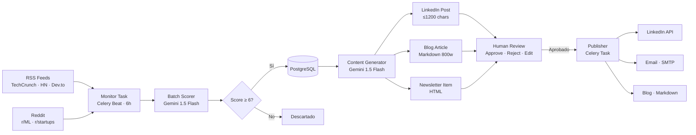

# ⚡ ContentFlow — AI Content Automation Pipeline

> Un pipeline end-to-end que monitorea tendencias de RSS y Reddit, las evalúa con IA, genera borradores multi-canal y los publica tras aprobación humana.

[](https://content-flow-o1umn639s-wuillianfmendez-5485s-projects.vercel.app)
[](https://fastapi.tiangolo.com)
[](https://ai.google.dev)
[](https://playwright.dev)
[](LICENSE)

---

## 🎯 Por qué esto no es otro CRUD genérico

La mayoría de proyectos de portafolio crean, leen, actualizan y eliminan registros. ContentFlow resuelve un problema real: **el costo de tiempo de crear contenido consistente de calidad para múltiples canales**.

El pipeline completo corre automáticamente cada 6 horas:



---

## ✨ Features técnicos destacados

| Feature | Detalle |
|---|---|
| **AI Pipeline** | Gemini 1.5 Flash + fallback automático a Groq/Llama 3.3 70B |
| **Batch scoring** | 1 llamada a la IA evalúa N tendencias (evita rate limit) |
| **Transparencia IA** | Cada borrador muestra prompt exacto, tokens y costo en USD |
| **Demo Mode** | App funciona sin backend con datos realistas (portfolio-ready) |
| **JWT Auth** | Login seguro · bcrypt + HS256 · usuario demo incluido |
| **Real-time feed** | Actividad reciente sin WebSockets (ActivityContext) |
| **E2E Tests** | Playwright · 15+ test cases cubriendo flujos críticos |
| **Sentry** | Error tracking en producción (opcional vía env var) |
| **Calendario editorial** | Vista mensual de contenido generado/publicado |
| **Mobile-first** | Sidebar hamburguesa, responsive en todas las páginas |

---

## 🏗️ Arquitectura

```
content-flow/
├── backend/                    # FastAPI + Celery
│   ├── api/
│   │   ├── auth.py            # JWT auth endpoints
│   │   ├── trends.py          # Trend CRUD + stats
│   │   └── content.py         # Draft CRUD + AI metadata
│   ├── generators/
│   │   ├── base.py            # generate_with_tracking() + cost calc
│   │   ├── linkedin.py        # LinkedIn post generator
│   │   ├── blog.py            # Blog article generator
│   │   └── newsletter.py      # Newsletter HTML generator
│   ├── sources/
│   │   ├── rss.py             # feedparser integration
│   │   └── reddit.py          # PRAW integration
│   ├── workers/
│   │   ├── celery_app.py      # Celery + Redis config
│   │   └── tasks.py           # monitor · generate · publish tasks
│   └── publishers/
│       ├── linkedin.py        # LinkedIn API publisher
│       └── newsletter.py      # SMTP publisher
│
├── frontend/                   # React 18 + Vite + Tailwind
│   ├── src/
│   │   ├── context/
│   │   │   ├── AuthContext.jsx     # JWT + demo mode bypass
│   │   │   └── ActivityContext.jsx # Real-time activity feed
│   │   ├── pages/
│   │   │   ├── LoginPage.jsx       # Auth con credenciales demo visibles
│   │   │   ├── Dashboard.jsx       # Stats + pipeline + activity feed
│   │   │   ├── TrendsPage.jsx      # Trends + desglose de criterios IA
│   │   │   ├── ContentPage.jsx     # Drafts + panel de transparencia IA
│   │   │   └── CalendarPage.jsx    # Calendario editorial mensual
│   │   ├── hooks/
│   │   │   └── useApiStatus.js     # Health check polling cada 30s
│   │   └── data/
│   │       └── demoData.js         # Mock data realista con metadatos IA
│   └── e2e/                        # Playwright tests
│       ├── auth.spec.js
│       ├── dashboard.spec.js
│       └── content.spec.js
│
├── docker-compose.yml          # Postgres + Redis + FastAPI + Celery
└── railway.toml                # Railway deployment config
```

---

## 🚀 Quick Start (local)

```bash
# 1. Clonar
git clone https://github.com/wfmendez/content-flow.git
cd content-flow

# 2. Variables de entorno
cp backend/.env.example backend/.env
# Edita .env — mínimo: GEMINI_API_KEY

# 3. Levantar toda la stack
docker compose up

# Frontend: http://localhost:5173
# Backend:  http://localhost:8000/docs
```

**Demo credentials:** `demo@contentflow.io` / `demo2024`

---

## 🔑 Variables de entorno

| Variable | Descripción | Requerida |
|---|---|---|
| `DATABASE_URL` | PostgreSQL connection string | ✅ |
| `REDIS_URL` | Redis connection string | ✅ |
| `GEMINI_API_KEY` | Google AI Studio API key | ✅ |
| `GROQ_API_KEY` | Groq API key (fallback automático) | Opcional |
| `REDDIT_CLIENT_ID` / `SECRET` | Reddit app credentials | Opcional |
| `LINKEDIN_ACCESS_TOKEN` | LinkedIn OAuth token | Opcional |
| `SMTP_USER` / `SMTP_PASSWORD` | Email publishing | Opcional |
| `SENTRY_DSN` | Error tracking | Opcional |
| `VITE_API_URL` | Backend URL para frontend en producción | Producción |

---

## 🧪 Tests E2E

```bash
cd frontend
npm install
npx playwright install chromium

npm run test:e2e        # headless
npm run test:e2e:ui     # interfaz visual
```

Los tests cubren: autenticación, demo mode, dashboard stats, expansión de tarjetas, confirmaciones inline, filtros de contenido y el calendario editorial.

---

## 💡 Decisiones técnicas

**¿Por qué Celery + Redis en lugar de cron jobs?**
El pipeline necesita reintentos automáticos, backoff exponencial en rate limits y paralelismo entre canales. Celery Beat maneja la programación y los Workers el procesamiento.

**¿Por qué Gemini + Groq como fallback?**
El free tier de Gemini 1.5 Flash tiene 15 RPM de límite. En vez de fallar, el sistema hace fallback automático a Groq/Llama 3.3 70B (14.400 req/día gratis). Ambos son completamente gratuitos para uso personal.

**¿Por qué batch scoring?**
Una sola llamada a la IA puntúa todos los artículos simultáneamente. Reduce latencia ~10x y evita rate limit al máximo.

**¿Por qué JWT sin tabla de usuarios?**
Para portfolio, un usuario demo hardcodeado con bcrypt demuestra autenticación segura real sin necesidad de registro. En producción se añadiría tabla `users`.

---

## 📊 Costo real de operación

Estimado con Gemini 1.5 Flash (free tier):

| Operación | Tokens promedio | Costo |
|---|---|---|
| Batch scoring (10 artículos) | ~200 input | $0.000015 |
| Generar post LinkedIn | ~400 in · ~300 out | $0.000120 |
| Generar artículo blog | ~420 in · ~900 out | $0.000302 |
| Generar newsletter item | ~300 in · ~240 out | $0.000095 |
| **Pipeline completo (1 tendencia)** | **~1.320 tokens** | **~$0.00052** |

> El pipeline cuesta **menos de $0.001 por tendencia procesada** — viable en el free tier de Gemini para uso personal indefinidamente.

---

## 🗺️ Roadmap

- [ ] Multi-tenant con registro de usuarios
- [ ] Integración con Notion como CMS de blog
- [ ] Analytics de engagement (clics, likes, shares)
- [ ] Soporte Twitter/X y Substack
- [ ] Fine-tuning de prompts por canal con feedback loop

---

## 👤 Autor

**Wuillian Méndez** · [GitHub](https://github.com/wfmendez) · [LinkedIn](https://linkedin.com/in/wfmendez)

> Construido como demostración de un pipeline de automatización de contenido end-to-end con IA generativa, orquestación asíncrona y despliegue en la nube.
